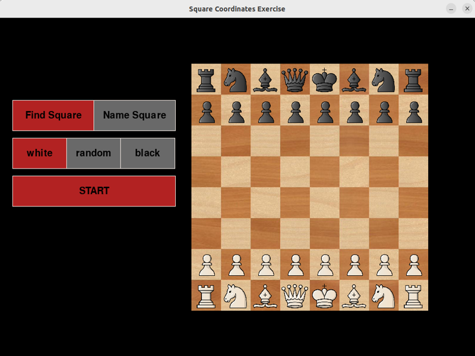
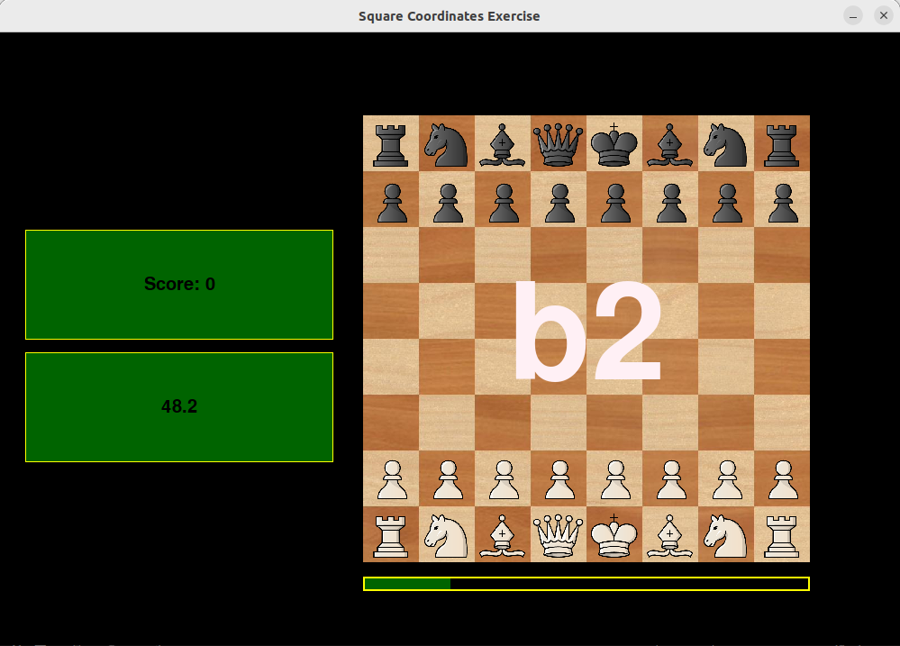
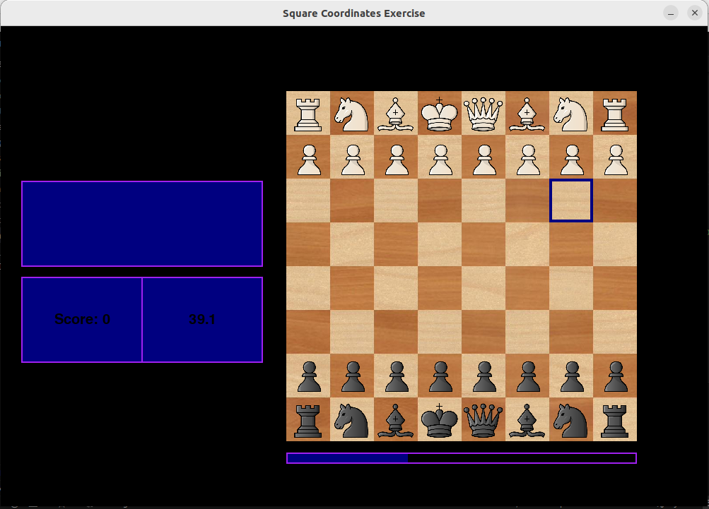
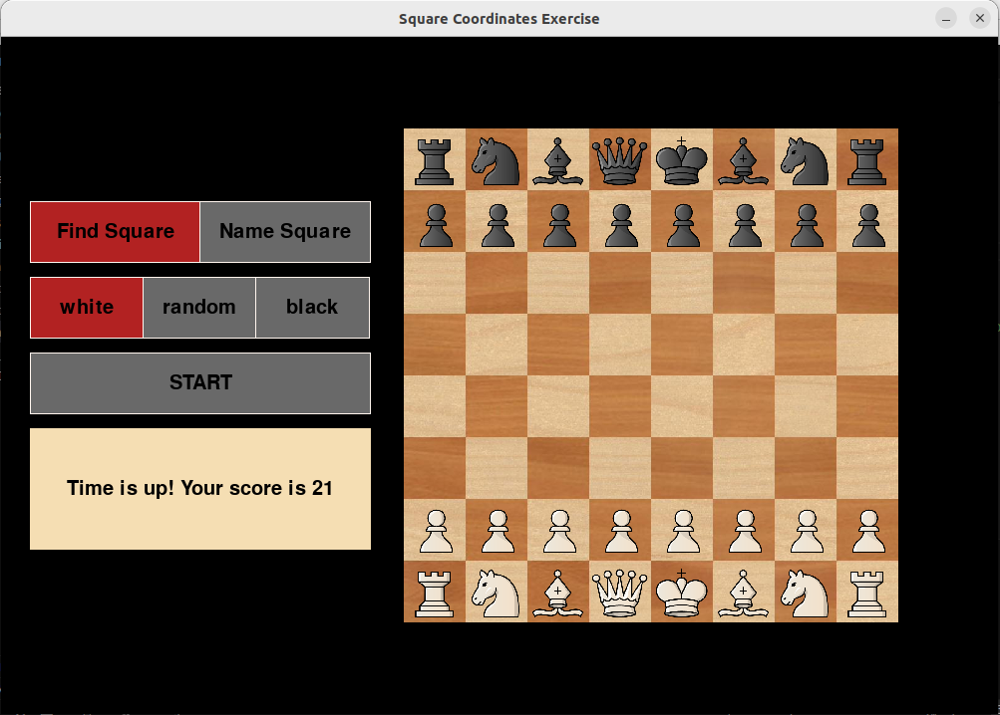

## What does this code do?
This is a game where the player trains to locate squares on a chess board fast. There are two options:
- find square: The player sees coordinates of a random square and they have to click on the corresponding square.
- name square: A random square is highlighted and the player has to write down its coordinates.  

Library used: pygame
## Motive behind this repo:
Practicing this games helps:
- Following the moves fast while listening to chess commentators.
- Communicating your moves with others fast enough.

## Some demo images:
Main menu:

Find Square Game:

Name Square Game:

Score at the end of a game:

 

